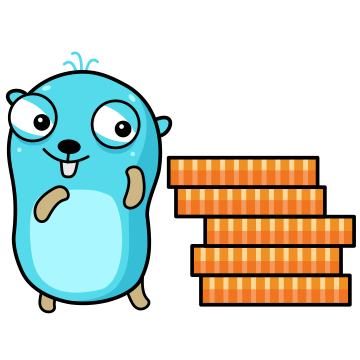
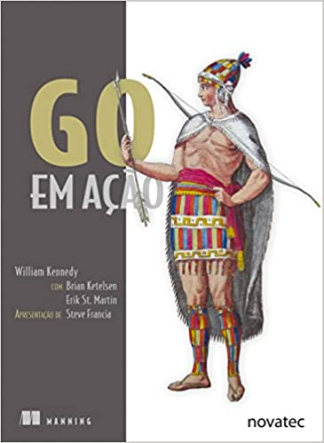
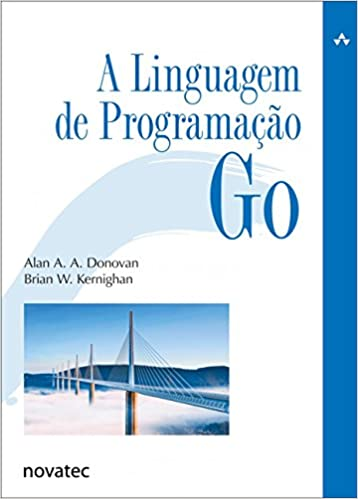
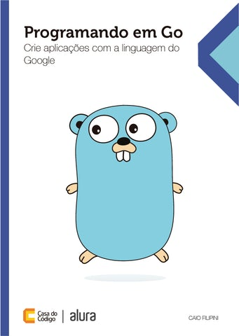

# Livros sobre Golang
Voltar para: [Cursos e tutoriais em vídeo Gratuitos](../free-videos-references/README.md)

- [Livros sobre Golang](#livros-sobre-golang)
  - [Go em Ação](#go-em-ação)
  - [A Linguagem de Programação Go](#a-linguagem-de-programação-go)
  - [Programando em Go](#programando-em-go)

## Go em Ação

[Compra na Amazon](https://www.amazon.com.br/Go-em-A%C3%A7%C3%A3o-William-Kennedy/dp/8575225065)

**<u>Descrição</u>**

O desenvolvimento de aplicações pode ser bem complicado, mesmo quando não estamos lidando com problemas de programação de sistemas complexos, como concorrência em escala web e desempenho de tempo real. Embora seja possível resolver esses problemas comuns com ferramentas e frameworks adicionais, Go já vem pronto para lidar com eles, deixando a experiência de programação muito mais natural e produtiva. Desenvolvida no Google, a eficácia da linguagem Go confere agilidade tanto a startups quanto a empresas de grande porte, companhias que dependem de serviços de alto desempenho em sua infraestrutura.

Go Em Ação é um livro para qualquer desenvolvedor de nível intermediário, com experiência em outras linguagens de programação, que queiram um início imediato no aprendizado de Go ou melhor compreensão da linguagem e de sua organização interna. Esta obra oferece uma visão detalhada, abrangente e idiomática de Go. Ela está concentrada na especificação e na implementação da linguagem, incluindo assuntos como sintaxe da linguagem, sistema de tipos de Go, concorrência, canais e testes.

_Conteúdo do livro_

Especificação e implementação da linguagem
Sistema de tipos de Go
Organização interna das estruturas de dados de Go
Testes e benchmarking
Este livro pressupõe que você seja um desenvolvedor atuante, proficiente em outra linguagem como Java, Ruby, Python, C# ou C++.

**<u>Sobre o autor</u>**

William Kennedy é um desenvolvedor de software experiente e autor do blog Goin Go Net; Brian Ketelsen é um dos organizadores do GopherCon e coautor do framework Skynet baseado em Go; Erik St. Martin é um dos organizadores do GopherCon e coautor do framework Skynet baseado em Go

**<u>Detalhes</u>**

* Editora: Novatec Editora (24 maio 2016)
* Idioma: Português
* Capa comum: 304 páginas
* Avaliações na amazon: 4,6 de 5 estrelas 

## A Linguagem de Programação Go

**<u>Descrição</u>**   

A linguagem de programação Go é a fonte mais confiável para qualquer programador que queira conhecer Go. O livro mostra como escrever código claro e idiomático em Go para resolver problemas do mundo real. Esta obra não pressupõe conhecimentos prévios de Go nem experiência com qualquer linguagem específica, portanto você a achará acessível, independentemente de se sentir mais à vontade com JavaScript, Ruby, Python, Java ou C++.
O primeiro capítulo contém um tutorial com os conceitos básicos de Go, apresentado por meio de programas para E/S de arquivos e processamento de texto, imagens gráficas simples, clientes e servidores web.
Os primeiros capítulos discutem os elementos estruturais de programas Go: sintaxe, controle de fluxo, tipos de dados e a organização de um programa em pacotes, arquivos e funções. Os exemplos apresentam muitos pacotes da biblioteca-padrão e mostram como criar seus próprios pacotes. Capítulos mais adiante explicam o sistema de pacotes com mais detalhes, além de mostrar como compilar, testar e manter projetos usando a ferramenta go.

**<u>Sobre o autor</u>**   

Alan A. A. Donovan é membro da equipe de Go do Google em Nova York. Estudou ciência da computação em Cambridge e no MIT, e trabalha com programação no mercado desde 1996. A partir de 2005, passou a trabalhar para o Google em projetos de infraestrutura e foi coprojetista do Blaze, o sistema proprietário de build dessa empresa. Criou várias bibliotecas e ferramentas para análise estática de programas Go, incluindo oracle, godoc -analysis, eg e gorename. Brian W. Kernighan é professor do departamento de ciência da computação da Universidade de Princeton. Participou da equipe técnica do Computing Science Research Center do Bell Labs de 1969 até o ano 2000, onde trabalhou com linguagens e ferramentas para Unix. É coautor de vários livros, incluindo C: A linguagem de programação – padrão ANSI (Campus, 1989) e The Practice of Programming (Addison-Wesley, 1999).

**<u>Detalhes</u>**

* Editora: Novatec Editora, 1ª edição (14 março 2017)
* Idioma: Português
* Capa comum: 480 páginas
* Avaliações na amazon: 4,9 de 5 estrelas  

---

Ir para próximo: [Frameworks e bibliotecas](../frameworks-and-libraries/README.md)

## Programando em Go   

[Compra na casa do código](https://www.casadocodigo.com.br/products/livro-google-go?_pos=1&_sid=846dbd1e4&_ss=r)

**<u>Descrição</u>**  

Go é uma linguagem moderna, criada com o objetivo principal de melhorar a produtividade no desenvolvimento em larga escala de servidores, baseado nas experiências de alguns times dentro do Google.

Hoje, mais de quatro anos após ter sido anunciada publicamente, cada vez mais empresas têm adotado a linguagem para escrever diversos tipos diferentes de aplicações, muito além dos servidores.

Go traz um misto interessante de recursos de alto e baixo nível que a torna atraente para diferentes públicos. Suas principais características incluem o controle inteligente de dependências, compilação rápida e eficiente, sintaxe simples, gerenciamento automático de memória incluindo um coletor de lixo, sistema de tipos forte e estático, funções de primeira classe e suporte nativo e de alto nível para concorrência.

Este livro apresenta ao leitor os recursos da linguagem Go e importantes partes de sua biblioteca padrão, sempre incluindo exemplos relevantes que demonstram o uso de cada recurso.

**<u>Sobre o autor</u>**  

Caio Filipini é Bacharel em Sistemas de Informacão e trabalha com tecnologia desde 2003. Já participou de diversos projetos como desenvolvedor e consultor, a maioria envolvendo as linguagens Java, JavaScript e Ruby. Foi desenvolvedor na Caelum, mudou-se para Berlim, onde passou por empresas como Fyber e SoundCloud, e atualmente trabalha como engenheiro de software sênior na DigitalOcean.

**<u>Detalhes</u>**

* Número de páginas: 190
* Data publicação: 06/2014

---

Ir para próximo: [Framework e bibliotecas](../frameworks-and-libraries/README.md)